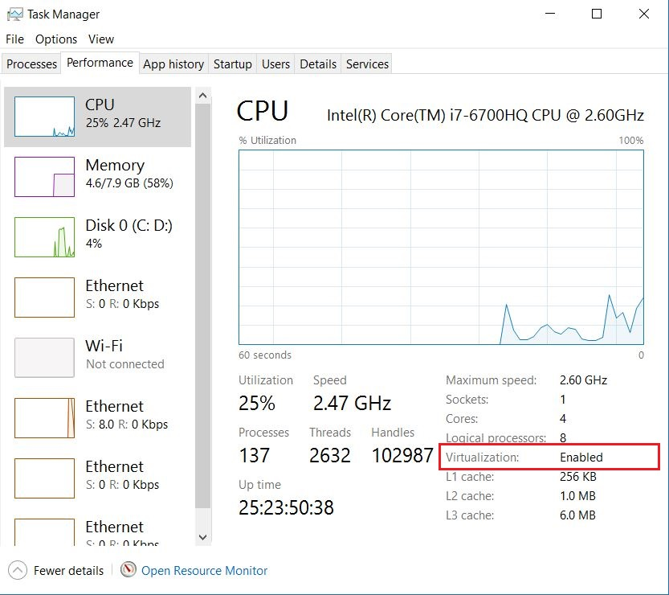
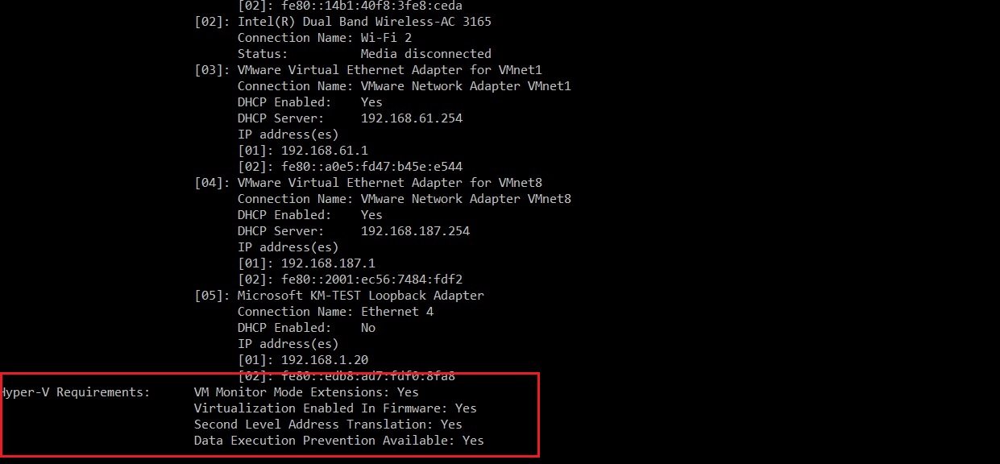

## How to find out if Intel VT-x or AMD-V Virtualization Technology is supported in Windows 10, Windows 8, Windows Vista or Windows 7 machine
How to find out if Intel VT-x or AMD-V Virtualization Technology is supported in Windows 10, Windows 8, Windows Vista or Windows 7 machine

## First method – Easiest option- Check your Task Manager
If you have Windows 10 or Windows 8 operating system, the easiest way to check is by opening up Task Manager->Performance Tab. 
You should see Virtualization as shown in the below screenshot. 
If it is enabled, it means that your CPU supports Virtualization and is currently enabled in BIOS. 
If it shows disabled, you need to enable it in BIOS. If you don’t see virtualization, 
it means that your CPU does not support virtualization.

## Second method – Check using systeminfo command in windows terminal
Open Windows terminal or command prompt and type the following command:

systeminfo

Below is the systeminfo command screenshot in windows terminal. If you see “Yes” for Hyper V requirement properties, encircled in red box, it means that you have Virtualization capable CPU which could either be AMD-V or Intel VT-x. Please note that this method does not tell you which class of CPU(Processor) is present in your computer. All you can deduce from this is that, you have virtualization capable CPU, which could either be Interl VT-x or AMD-V.

